# Antimony for Visual Studio Code

#### [Repository](https://github.com/sys-bio/vscode-antimony/tree/master/vscode-antimony)&nbsp;&nbsp;|&nbsp;&nbsp;[Issues](https://github.com/sys-bio/vscode-antimony/issues)&nbsp;&nbsp;|&nbsp;&nbsp;[Code Examples](https://github.com/sys-bio/vscode-antimony/tree/master/examples)&nbsp;&nbsp;|&nbsp;&nbsp;[Antimony Reference](https://tellurium.readthedocs.io/en/latest/antimony.html)&nbsp;&nbsp;|&nbsp;&nbsp;[tellurium](https://tellurium.readthedocs.io/en/latest/index.html)&nbsp;&nbsp;

The Antimony extension adds language support for Antimony to Visual Studio Code for building models in Systems Biology.

The currently available version 0.2 is a public beta version developed by [Longxuan Fan](https://www.linkedin.com/in/longxf), [Sai Anish Konanki](https://www.linkedin.com/in/sai-anish-konanki-8b81a575/), [Eva Liu](https://www.linkedin.com/in/evaliu02), [Steve Ma](https://www.linkedin.com/in/steve-ma/), [Gary Geng](https://www.linkedin.com/in/gary-geng-9995a2160/), [Dr. Joseph Hellerstein](https://sites.google.com/uw.edu/joseph-hellerstein/home?authuser=0), and [Dr. Herbert Sauro](https://bioe.uw.edu/portfolio-items/sauro/) at the University of Washington. Dr. Joseph Hellerstein is responsible for future releases, and please feel free to [contact](mailto:joseph.hellerstein@gmail.com) him if you have any questions.

Please note that the current release does not support the complete Antimony grammar. While most grammar has been supported, more will be included in future releases. Flux balance constraints and submodeling are not supported currently.

## **Installation**

You need Visual Studio Code and nothing else.

**1. Install Visual Studio Code**

Download it from [code.visualstudio.com](https://code.visualstudio.com/download) and open it.

**2. Install the Antimony Extension Pack**

Click the Extensions icon in the left sidebar, search for **Antimony Extension Pack**, and click Install. (We recommend installing the extension pack directly so you have full access to all of the features.)

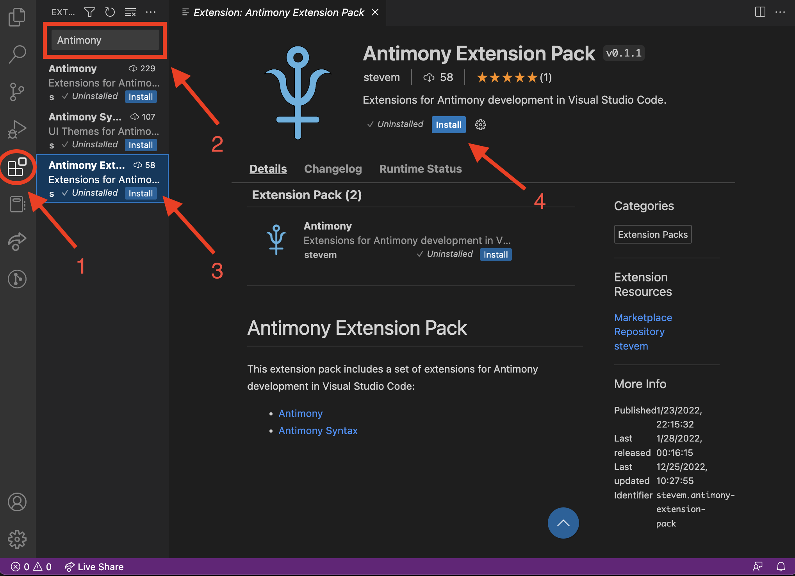
 
<em>(Download Antimony Extension)</em>

**3. Open a model file**

Open any `.ant` or `.xml` model. If you do not have one, open the Command Palette (Ctrl + Shift + P for Windows, Cmd + Shift + P for Mac) and type **Open Antimony Start Page**.

The first time you do this, Antimony downloads the components it needs and shows a progress notification. It takes a minute or two, happens only once, and you can keep working in other files while it runs.

Now, right clicking anywhere in the .ant file will display a list of features that can be accessed by users.

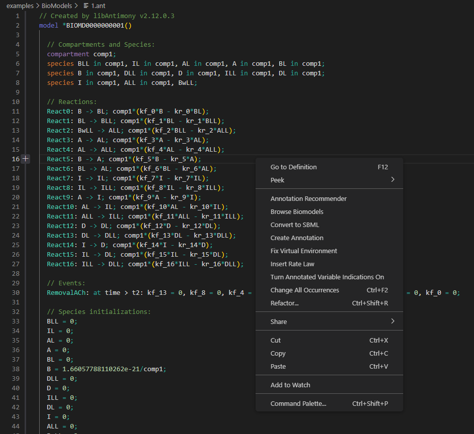
 
<em>(List of options when right clicking in the file)</em>

### Supported systems

| System | Requirement |
| --- | --- |
| Windows | 64-bit, Windows 10 or later |
| Mac (Apple Silicon) | macOS 14 or later |
| Linux | 64-bit x86 |

Intel Macs are not set up automatically. The extension still works on them, but you will need to install Python 3.10 yourself and point the extension at it. See [Advanced setup](#advanced-setup).

### If something goes wrong

Open the Command Palette (Ctrl + Shift + P for Windows, Cmd + Shift + P for Mac), run **Antimony: Reinstall Components**, and reload when prompted. This clears the downloaded components and fetches them again.

If your institution blocks downloads from GitHub, setup will fail. When it does, the error offers an **Install from file...** option: it copies a download link to your clipboard, and you can download that file any way you can and then select it. The file is checked before it is installed.

If you used an earlier version of this extension, it created a folder called `vscode_antimony_virtual_env` in your home directory. It is no longer used and can be deleted.

### Advanced setup

If you manage your own Python environment, set `vscode-antimony.pythonInterpreter` to the full path of a Python 3.10 interpreter that has the extension's dependencies installed. You can change this in the VSCode Settings in section Extensions/vscode-antimony. Use (Cmd + ,) for Mac and (Ctrl + ,) for Windows. Leaving it blank uses the interpreter that ships with the extension, which is what almost everyone should do.

## Features
The extension provides many convenient features for developing biological models with the Antimony language in tellurium. The current release focuses on the areas below.

### 1. SBML to Antimony Conversion and Editing

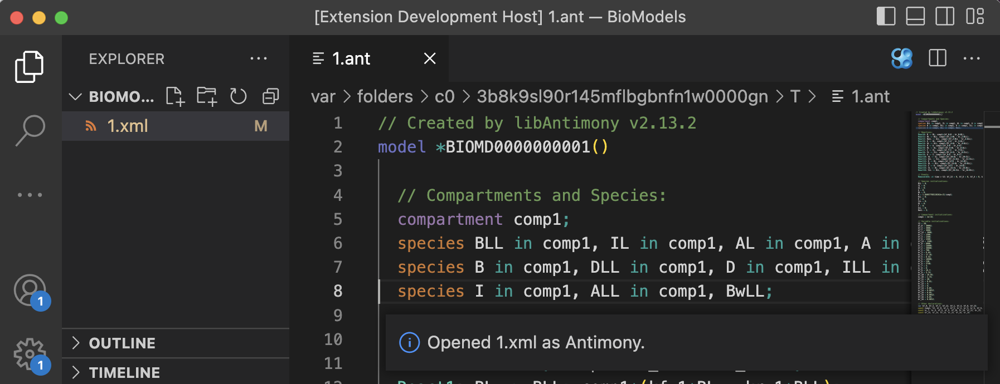
 
<em>(SBML to Antimony conversion)</em>

When an SBML file is opened, the editor will automatically convert the SBML file to the Antimony format. User can edit the Antimony file, and save the changes made to the Antimony model back to the original SBML file.
⚠️ Note: this feature can be disabled in settings

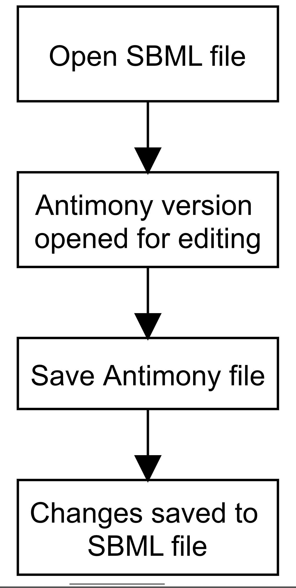
 
<em>(Diagram of workflow)</em>

### 2. Browsing Biomodels
The extension allows a user to browse for different biomodels from the [BioModels database](https://www.ebi.ac.uk/biomodels/search?query=*%3A*). The user can query for models with a string or a model number. The chosen model will be displayed in Antimony, which can be saved as SBML or Antimony.

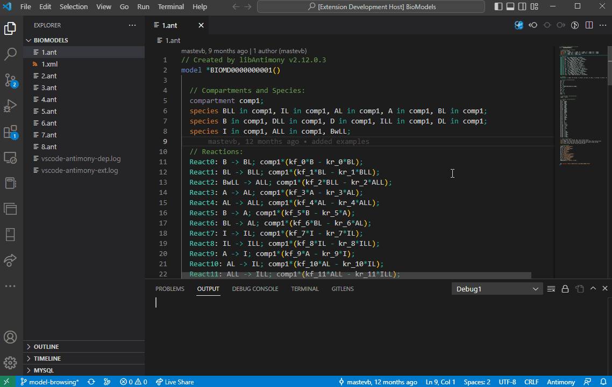
 
<em>(Biomodel Browsing with saving)</em>

### 3. Syntax recognition and highlights

 
<em>(Syntax Highlights)</em>

⚠️ Note: the default syntax highlighting for Antimony is provided by a separate extension [Antimony Syntax](https://marketplace.visualstudio.com/items?itemName=stevem.vscode-antimony-syntax), and is also available in the [Antimony Extension Pack](https://marketplace.visualstudio.com/items?itemName=stevem.antimony-extension-pack) 

### 4. Automatic annotation creation with database recommendation
The extension can recognize different types of variables, and recommend databases based on the [OMEX metadata specification](https://doi.org/10.1515/jib-2021-0020).

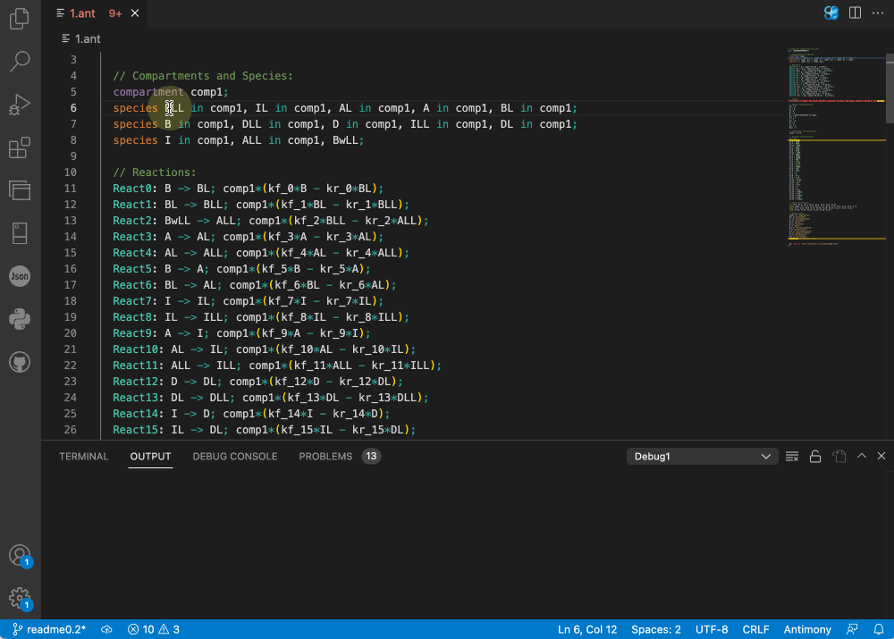
 
<em>(Creating an annotation of species BLL through the ChEBI database)</em>

### 5. Hover messages 

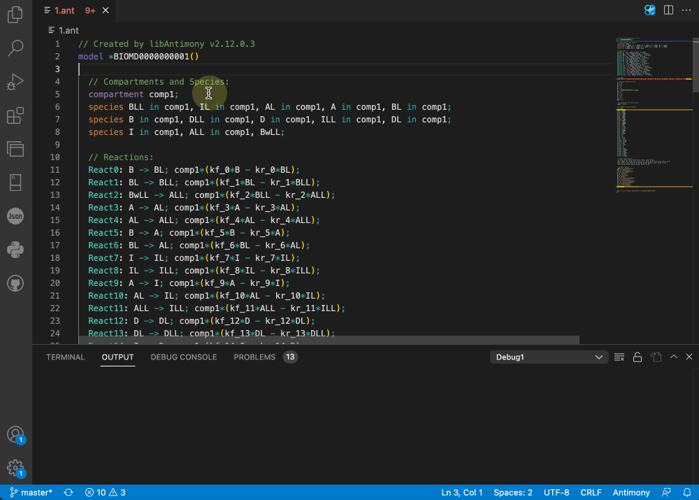
 
<em>(Hovering over species to look up information)</em>

### 6. Code navigation

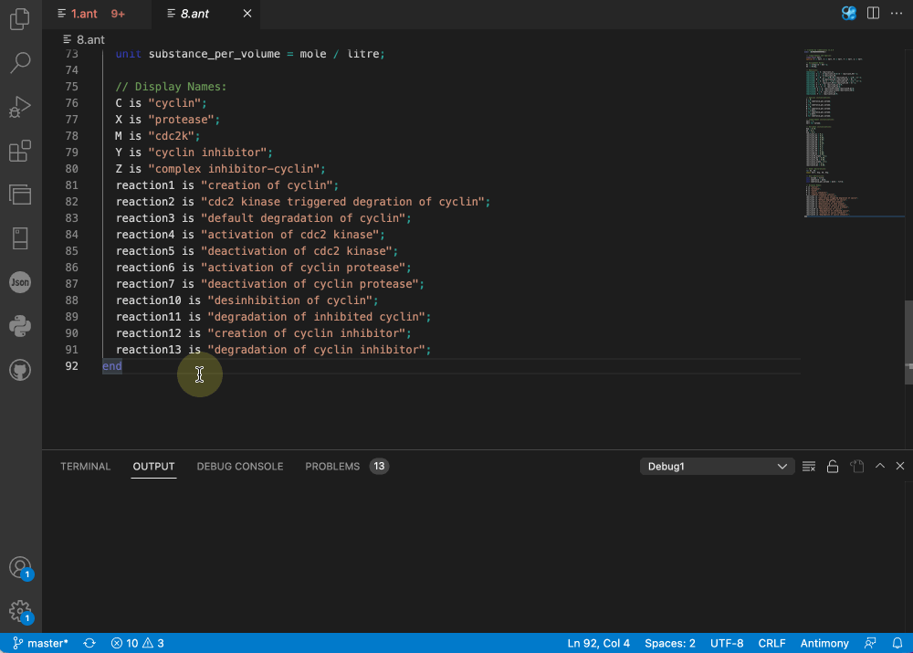
 
<em>(Navigating to the definition code)</em>

### 7. Error detection
The extension supports various warning and error detections to help modelers debug their model during development. Our design principle for whether an issue should be a warning or an error entirely depends on the logic of tellurium. Our extension will mark the subject as an error if tellurium throws an error while rendering the model, with a red underline. An example would be calling a function that does not exist (usually due to a typo, which is extremely common during development. Read more in my [thesis](https://drive.google.com/file/d/1FutuOYgq9Jd_AHqp_z4f2joDavVIURuz/view?usp=sharing)).

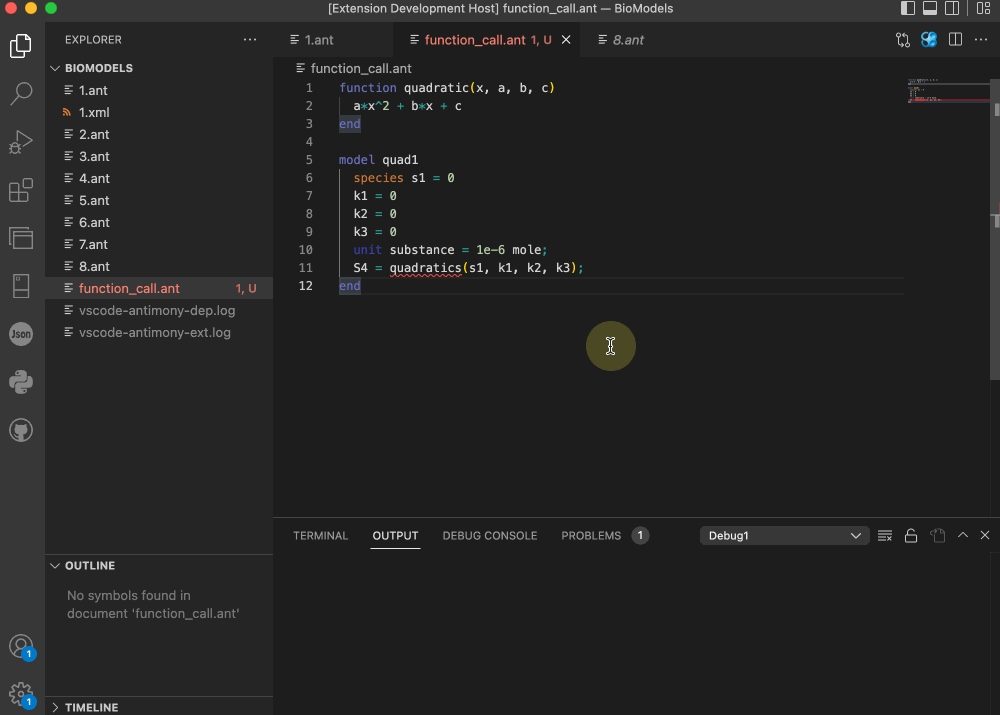
 
<em>(Typos are extremely common in software development)</em>

On the other hand, certain issues are not errors in tellurium, but we thought it would be worthwhile to have the user's attention. For example, missing initial values for species and overriding a previously defined value.

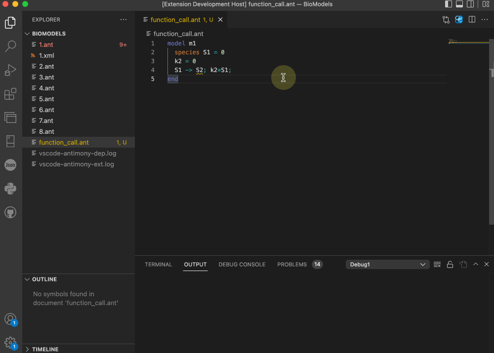
 
<em>(Forgetting to initialize the value for a species, causing tellurium to assume a default value)</em>

The extension supports a wide range of errors and warnings, and we plan to support more in the upcoming releases. Read more in [issues](https://github.com/sys-bio/vscode-antimony/issues).

### 8. Converter between Antimony and SBML

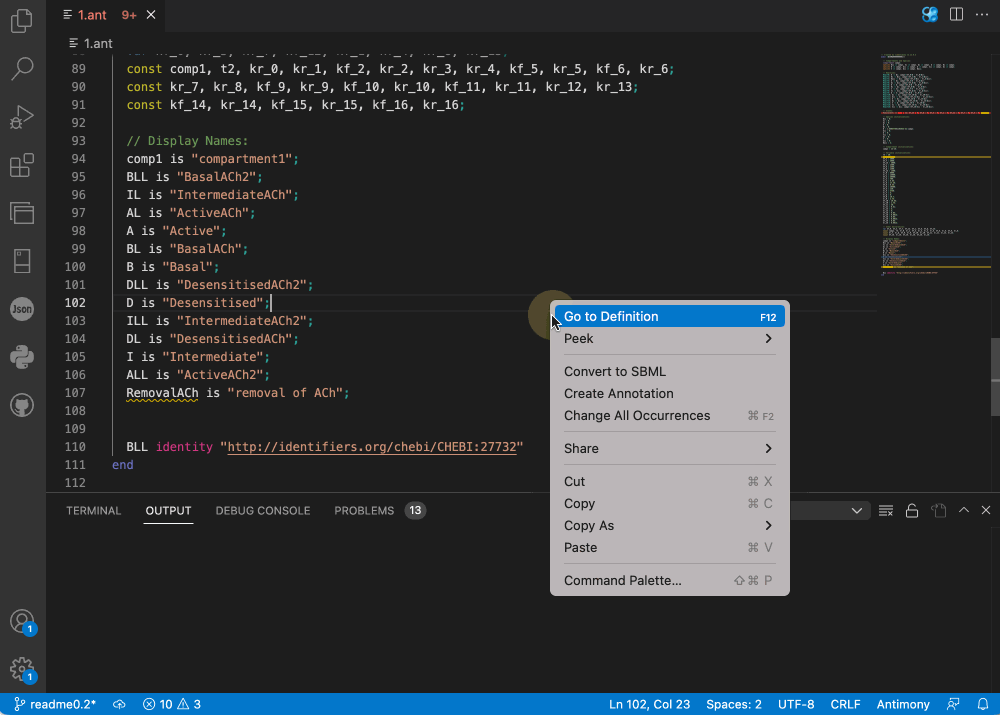
 
<em>(Exporting Antimony file in SBML format)</em>

### 9. Antimony/SBML preview

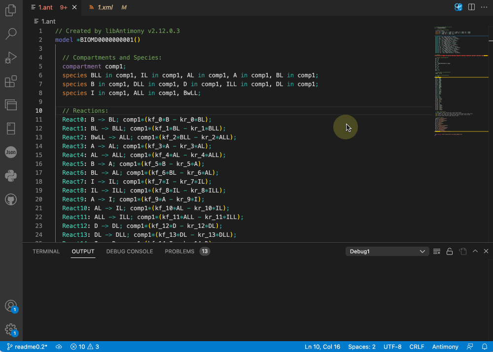
 
<em>(Previewing Antimony file as SBML)</em>

### 10. Automatic creation of rate laws

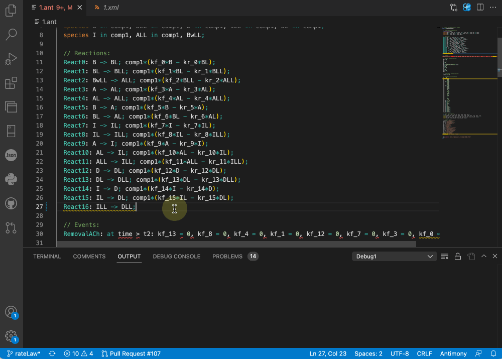
 
<em>(Creating a rate law on a reversible reaction)</em>

### 11. Annotation recommender for species

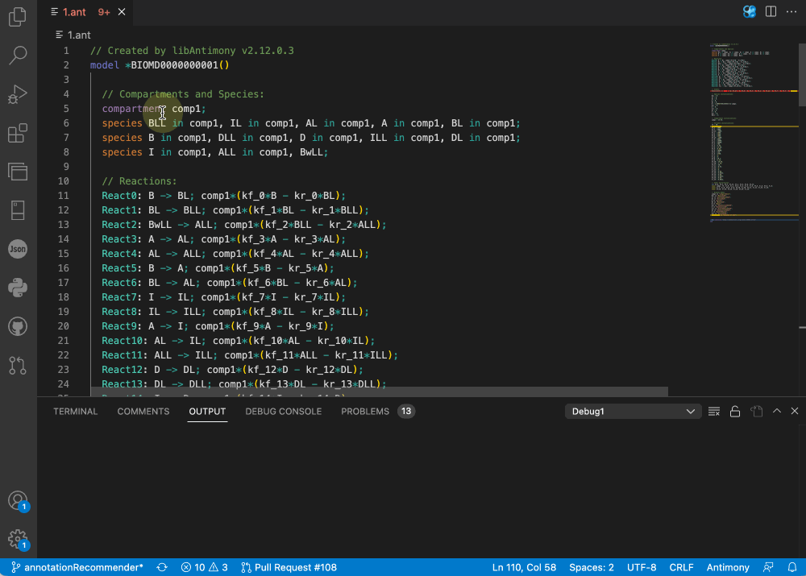
 
<em>(Creating annotation for species BLL with Annotation Recommender)</em>

### 12. Highlight indication for annotated species

 
<em>(Displaying highlight indication for annotated species, BLL)</em>

## Known Issues
I have an open issue for [manually curating models](https://github.com/sys-bio/vscode-antimony/issues/26) from BioModels to test the extension. Please feel free to contribute and submit issues.
* subvariables in modular models are currently not supported and false error messages will be triggered.
* Intel Macs require manual Python setup. See [Advanced setup](#advanced-setup).

## Release Notes

### 0.3.0
* Installation no longer requires Git, Python, or a separate dependency installer. The extension downloads the Python components it needs on first use.
* Fixed annotation lookups failing after the ChEBI web service changed. A failed lookup no longer breaks hover and error checking.
* Fixed the extension failing to start when a window was reopened with no file in focus.
* Faster startup.
* Setup resumes where it left off if interrupted, and verifies downloads before installing.
* "Delete Virtual Environment" is now "Antimony: Reinstall Components".

### 0.2.10
* Minor bug fixes
* Updated User Instructions

### 0.2.4
* Automatic virtual environment installation.
* SBML to Antimony Conversion and Editing.
* Browsing Biomodels.

### 0.2.0
* Added grammar support and warning/error detection for rate rules, sbo and cvterms, events, flux balance constraints, interaction, and import.
* Converter between Antimony and SBML.
* Antimony/SBML preview.
* More databases supported in create annotation, and database recommendations.
* Automatic creation of rate laws.
* Annotation recommender for species.
* Highlight indication for annotated species.

### 0.1.4
* Updated docs, included a list for updates in 0.2.

### 0.1.3
* Updated docs.

### 0.1.2
* Updated docs.

### 0.1.1
* Added docs and examples.
* Fixed an issue related to code navigation ([#46](https://github.com/sys-bio/vscode-antimony/issues/46)).
* Fixed an issue related to displaying hover message for annotated entities ([#47](https://github.com/sys-bio/vscode-antimony/issues/47)).

### 0.1.0
* First public release of the extension pack.